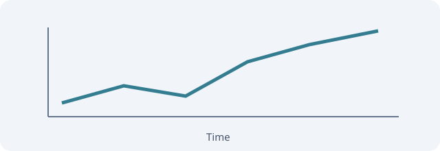

## 소개 {#sec-intro}

이 문서는 [결과 섹션](#sec-results)으로 이동하거나 @fig-trend 및 @tbl-results를 참조할 수 있습니다.

::: {.callout-note}
QMD의 코드 셀은 실행하지 않고 소스 코드로 표시합니다.
:::

## 그림과 표 {#sec-results}

{#fig-trend width="80%" fig-alt="시간이 지날수록 증가하는 선 그래프"}

| 조건 | 값 |
|------|---:|
| A    | 12 |
| B    | 18 |

: 조건별 측정값 {#tbl-results}

@fig-trend와 @tbl-results를 함께 읽고, @sec-intro로 돌아갑니다.

## 코드 셀 {#sec-code}

```{python}
#| label: fig-generated
#| fig-cap: "실행 환경에서 생성하는 그림"
print("이 코드는 리더에서 실행되지 않습니다.")
```

실행으로 생성되는 @fig-generated는 원본 QMD에 그림 파일이 없으므로 참조 대상을 표시할 수 없습니다.
